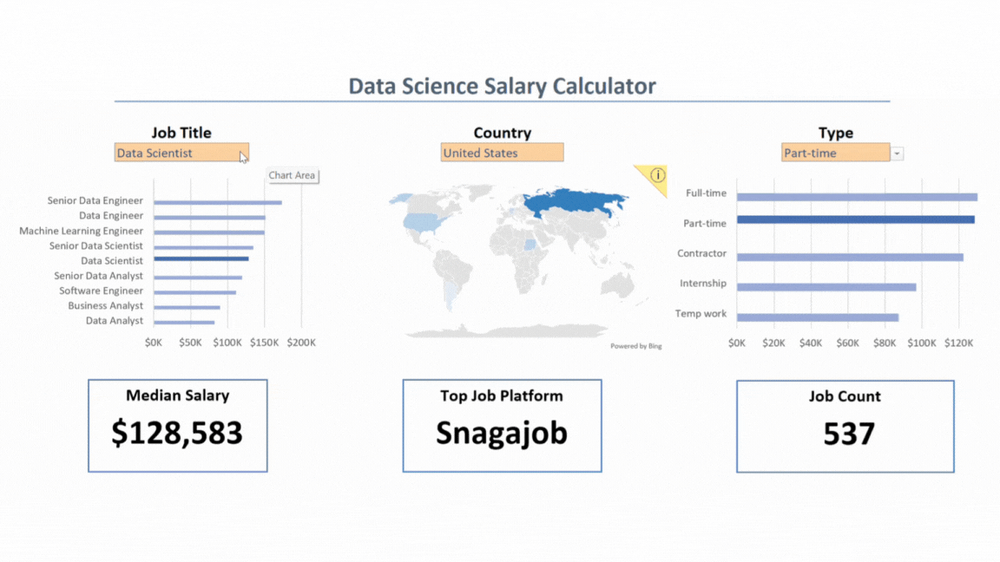

# Excel Salary Dashboard


## Introduction

This data jobs salary dashboard was created to help job seekers, like myself, investigate salaries for their target roles and ensure they’re being fairly compensated.

The dataset was provided by Luke Barousse as part of his Excel for Data Analytics course. It contains real-world salary data for a variety of data-related roles, including information on job titles, average annual salaries, countries, work schedules, and essential skills.

The goal of this project was to analyze this dataset and design a functional, interactive dashboard using Excel—equipping users with the ability to filter salary insights by role, location, and job type.

### Excel Skills Used

The following Excel features were used in this project:
- Charts
- Formulas and Functions
- Data Validation

### Data Jobs Dataset

The dataset used for this dashboard includes up-to-date job salary information relevant to data professionals. It features:
- Job Titles
- Salaries (Annual Average)
- Locations (by Country)
- Work Schedules (Full-Time, Contract, etc.)
- Required Skills

### Dashboard File

My final dashboard file is located here:  
[Excel_Project_1_Dashboard.xlsx](Excel_Project_1_Dashboard.xlsx)

## Dashboard Build

### Charts

#### Median Salaries by Job Title – Bar Chart

- Excel Feature: Bar chart with formatted salary values
- Design Choice: Used a horizontal bar chart for better readability and visual comparison
- Data Displayed: Median salary by job title
- Data Organization: Sorted by descending median salary
- Insight: Senior-level roles and engineering positions tend to offer higher salaries than analyst roles

#### Median Salaries by Country – Map Chart

- Excel Feature: Excel’s built-in map chart feature
- Design Choice: Color-coded regions based on salary range
- Data Displayed: Median salary by country
- Visual Enhancement: Geographic trends are more apparent at a glance
- Insight: This chart reveals global salary disparities, making it easy to spot higher- and lower-paying regions

#### Median Salaries by Job Schedule Type – Bar Chart

- Excel Feature: Bar chart
- Design Choice: Horizontal layout for easy comparison
- Data Displayed: Median salary by job schedule type (e.g., full-time, part-time, contract)
- Data Organization: Values sorted for clarity
- Insight: [To be added later—e.g., "Full-time positions generally pay more than contract roles"]

### Formulas and Functions

#### Filtered List of Job Schedule Types

To support dynamic filtering and data validation, a cleaned list of job schedule types was generated using the `FILTER()` function. This ensured dropdowns and formulas only referenced valid, distinct schedule types.

**Filtered Job Schedule Types Formula**

```excel
=FILTER(J2#,(NOT(ISNUMBER(SEARCH("and",J2#))+ISNUMBER(SEARCH(",",J2#))))*(J2#<>0))
```
- Purpose: Removes entries with "and", commas, and blank/zero values
- Output: A clean list of distinct job types (e.g., Full Time, Contract)
- Use Case: Supports dashboard filtering and improves dropdown usability
- Benefit: Ensures that users interact only with valid, meaningful job types

This cleaned list is also used to support the COUNT and MEDIAN formulas described below.

#### Job Count Based on Multiple Criteria

With a clean list of job types established, I used the following formula to count how many job listings matched a given combination of job title, country, and schedule type.

```excel
=COUNT(
 IF(
   (jobs[job_country]=country)*
   (jobs[job_title_short]=A2)*
   (ISNUMBER(SEARCH(type,jobs[job_schedule_type]))),
   jobs[salary_year_avg]
 )
)
```
- Filters: Country, job title, and job schedule type
- Output: Total number of job listings matching selected criteria
- Use Case: Supports the dashboard by giving users a sense of how common or rare a job type is across different regions and roles
- Note: Relies on the assumption that each job listing has a non-zero salary field

#### Median Salary Calculations

Building on the filtered data and job counts, I created three separate `MEDIAN()` formulas to calculate salary insights based on user-selected criteria. These formulas power the bar and map charts in the dashboard.

**1. Median Salary by Job Title**

```excel
=MEDIAN(
  IF(
    (jobs[job_title_short]=A2)*
    (jobs[salary_year_avg]<>0)*
    (jobs[job_country]=country)*
    (ISNUMBER(SEARCH(type,jobs[job_schedule_type]))),
    jobs[salary_year_avg]
  )
)
```
- Filters: Selected job title, country, and job schedule type
- Output: Used in the bar chart comparing salaries by job title

**2. Median Salary by Country**

```excel
=MEDIAN(
 IF(
   (jobs[job_country]=A2)*
   (jobs[salary_year_avg]<>0)*
   (jobs[job_title_short]=title)*
   (ISNUMBER(SEARCH(type,jobs[job_schedule_type]))),
   jobs[salary_year_avg]
 )
)
```
- Filters: Selected country, job title, and schedule type
- Output: Used in the map chart showing salaries across countries

**3. Median Salary by Job Schedule Type**

```excel
=MEDIAN(
  IF(
    (jobs[job_title_short]=title)*
    (jobs[salary_year_avg]<>0)*
    (jobs[job_country]=country)*
    (ISNUMBER(SEARCH(A2,jobs[job_schedule_type]))),
    jobs[salary_year_avg]
  )
)
```
- Filters: Selected job schedule type, job title, and country
- Output: Used in the bar chart comparing salary by job type

Note: `type`, `title`, `country`, and `A2` refer to user-selected values in the dashboard.

#### Dynamic Highlighting in Bar Charts

To improve how users interpret the salary data from the calculations above, I used helper columns to implement visual highlighting in the bar charts. This approach emphasizes the selected job title or schedule type using a darker color bar, while showing all other categories in lighter colors for context.

```excel
=IF($D2<>title,$E2,NA())  ← Light bars for non-selected values  
=IF($D2=title,$E2,NA())   ← Dark bar for selected value
```
- `$D2` contains the current job title in the sorted list
- `title` refers to the user’s selected job title from the dashboard
- `E2` is the corresponding median salary

When these formulas are used as two separate data series in a bar chart, Excel highlights the selected value while still displaying surrounding data—making insights easier to spot without losing overall context.

### Data Validation

To ensure user inputs remain consistent and accurate throughout the dashboard, data validation was applied to key dropdown selections, including Job Title, Country, and Job Schedule Type.

**Purpose of Data Validation**
- Restricts user input to a predefined list of valid options
- Prevents entry errors or inconsistent data selections
- Supports dynamic formulas and visuals by maintaining clean, reliable input values

**How It Was Implemented**
- The cleaned list of job schedule types (created with the `FILTER()` function) was used as the source for the Job Schedule Type dropdown
- Similar lists were created or referenced for Job Title and Country
- Excel's Data Validation feature was used to assign these lists to dropdown cells in the dashboard interface

**Impact on Dashboard**
- Improved usability and interactivity
- Ensured only valid filters were applied to formulas and charts
- Reduced risk of formula errors due to invalid or mismatched user input

## Conclusion

This project showcased how Excel can be used to create dynamic, interactive dashboards for real-world data analysis. Through a combination of formulas, data validation, and chart formatting, I was able to explore and visualize salary trends across job titles, countries, and schedule types—tools I’ll continue to build on in future analytics work.
