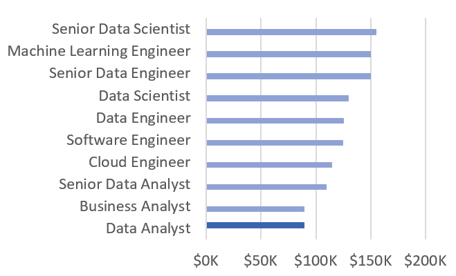
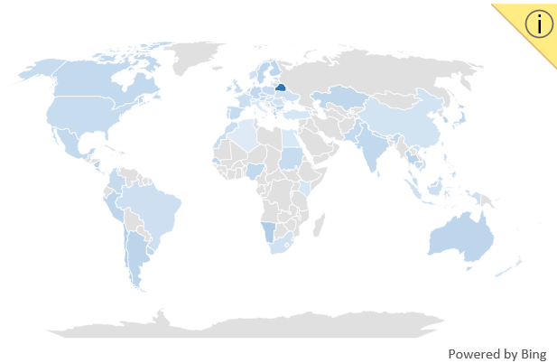
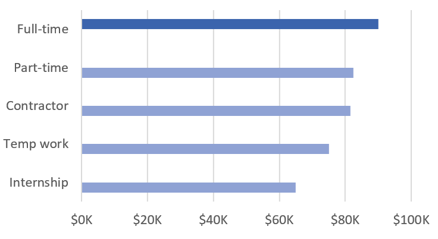
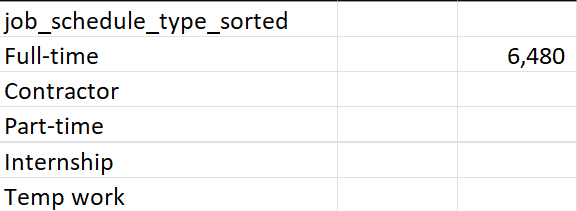
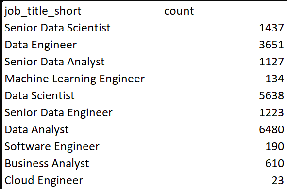
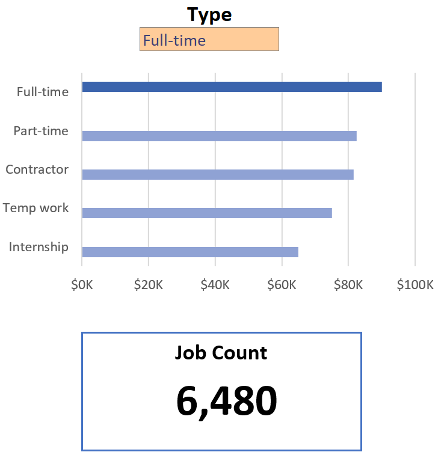
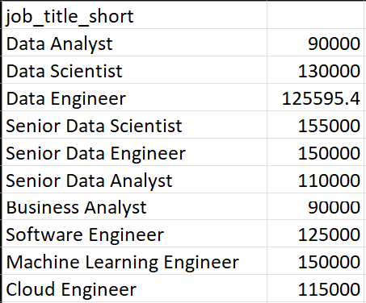
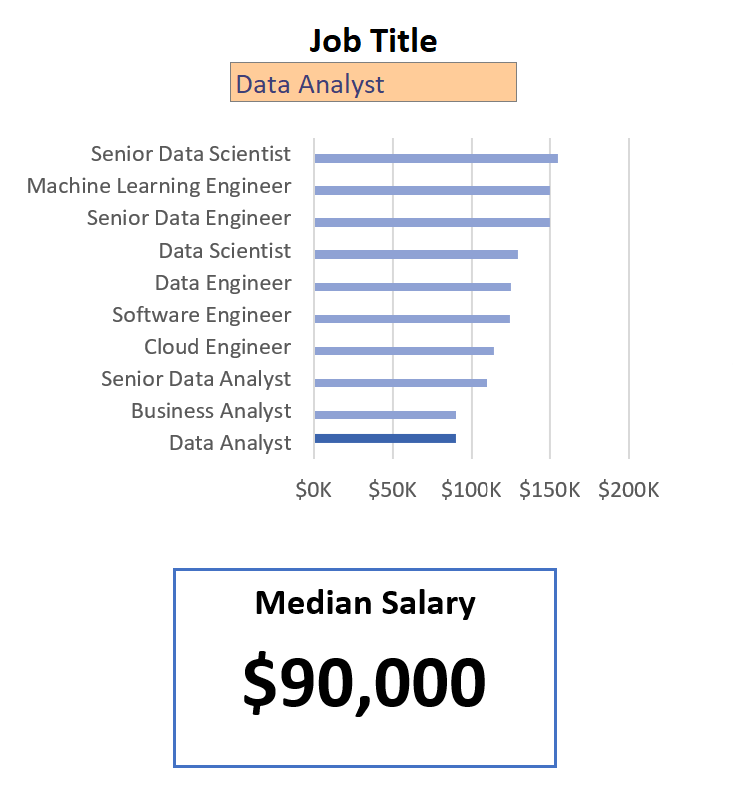

# Excel Salary Dashboard


## Introduction

This project uses Excel to create an interactive dashboard that helps job seekers explore salary trends for data-related roles by job title, country, and job schedule type.

The dataset was provided by Luke Barousse as part of his Excel for Data Analytics course. It includes:
* Job Titles
* Salaries (Annual Average)
* Locations (by Country)
* Work Schedules (Full-Time, Contract, etc.)
* Required Skills

Tools and Skills Used:
* Excel Charts (Bar, Map)
* Formulas: `FILTER()`, `COUNT()`, `MEDIAN()`, `IF()`, `SEARCH()`
* Data Validation and Dropdowns

My final dashboard file is located here:  
[Excel_Project_1_Dashboard.xlsx](Excel_Project_1_Dashboard.xlsx)

## Dashboard Build

### Median Salary by Job Title (Bar Chart)

* **Excel Feature**: Horizontal bar chart with formatted salary values
* **Design Choice**: Sorted by descending salary for easier comparison
* **Insight**: Compares compensation across different job titles, helping job seekers identify roles with higher earning potential 

### Median Salary by Country (Map Chart)

* **Excel Feature**: Built-in map chart with color-coded salary ranges
* **Design Choice**: Visualizes global compensation patterns by shading countries based on median pay
* **Insight**: Quickly reveals which countries offer higher or lower salaries

### Median Salary by Job Schedule Type (Bar Chart)

* **Excel Feature**: Horizontal bar chart with formatted salary values
* **Design Choice**: Sorted by descending salary for easier comparison
* **Insight**: Compares how employment type (e.g., full-time, part-time, contract) affects compensation, helping job seekers assess trade-offs between flexibility and pay

## Key Formulas and Logic

### Filtered List of Job Schedule Types

To support dynamic filtering, I used the `FILTER()` function to clean job schedule data by excluding entries with “and”, zeros, or blanks.
```excel
=FILTER(J2#,NOT(ISNUMBER(SEARCH("and",J2#)))*(J2#<>0))
```
* **Purpose**: Returns a distinct, clean list of valid job schedule types
* **Use Case**: Powers dropdown filters and formulas throughout the dashboard
* **Benefit**: Ensures that users interact only with valid job schedule types

<p><strong>Background Table:</strong><br>

</p>

<p><strong>Dashboard Implementation:</strong><br>

</p>

### Job Count Based on Multiple Criteria

With a clean list of job schedule types, I used this formula to count listings that match a specific job title, country, and schedule type.
```excel
=COUNT(
 IF(
   (jobs[job_country]=country)*
   (jobs[job_title_short]=A2)*
   (ISNUMBER(SEARCH(type,jobs[job_schedule_type]))),
   jobs[salary_year_avg]
 )
)
```
* **Purpose**: Counts job listings matching selected filters
* **Use Case**: Helps gauge how common or rare certain roles and job types are across regions
* **Note**: Assumes job listings have valid (non-zero) salary data

<p><strong>Background Table:</strong><br>

</p>

<p><strong>Dashboard Implementation:</strong><br>

</p>

### Median Salary Calculations

I used three `MEDIAN()` formulas to calculate salaries based on user-selected filters, powering the bar and map charts.

**1. Median Salary by Job Title**
```excel
=MEDIAN(
  IF(
    (jobs[job_title_short]=A2)*
    (jobs[salary_year_avg]<>0)*
    (jobs[job_country]=country)*
    (ISNUMBER(SEARCH(type,jobs[job_schedule_type]))),
    jobs[salary_year_avg]
  )
)
```
**2. Median Salary by Country**
```excel
=MEDIAN(
 IF(
   (jobs[job_country]=A2)*
   (jobs[salary_year_avg]<>0)*
   (jobs[job_title_short]=title)*
   (ISNUMBER(SEARCH(type,jobs[job_schedule_type]))),
   jobs[salary_year_avg]
 )
)
```
**3. Median Salary by Job Schedule Type**
```excel
=MEDIAN(
  IF(
    (jobs[job_title_short]=title)*
    (jobs[salary_year_avg]<>0)*
    (jobs[job_country]=country)*
    (ISNUMBER(SEARCH(A2,jobs[job_schedule_type]))),
    jobs[salary_year_avg]
  )
)
```
* **Filters Used**: Selected job schedule type, job title, and country
* **Output**: Drives the dashboard’s salary visualizations
* **Note**: `type`, `title`, `country`, and `A2` refer to user-selected values in the dashboard.

<p><strong>Background Table:</strong><br>

</p>

<p><strong>Dashboard Implementation:</strong><br>

</p>

### Dynamic Highlighting in Bar Charts
I used helper columns to highlight the selected value in bar charts using two formulas: one for light bars (others) and one for the dark bar (selected).
```excel
=IF($D2<>title,$E2,NA())  ← Light bars for non-selected values  
=IF($D2=title,$E2,NA())   ← Dark bar for selected value
```
* `$D2` contains the current job title in the sorted list
* `title` refers to the user’s selected job title from the dashboard
* `E2` is the corresponding median salary
* **Purpose**: When these formulas are used as two separate data series in a bar chart, Excel highlights the selected value while still displaying surrounding data—making insights easier to spot without losing overall context.

## Data Validation

Filtered lists were generated using formulas (e.g. `FILTER()`, `SORT()`, and `UNIQUE()`) and applied in data validation rules for dropdowns like Job Title, Country, and Job Schedule Type.
* Restricted input to predefined, valid values  
* Prevented inconsistent or incorrect entries  
* Ensured formula accuracy and reliable chart updates

## Conclusion

This project showcased how Excel can be used to create dynamic, interactive dashboards for real-world data analysis. Through a combination of formulas, data validation, and chart formatting, I was able to explore and visualize salary trends across job titles, countries, and job schedule types—tools I’ll continue to build on in future analytics work.
